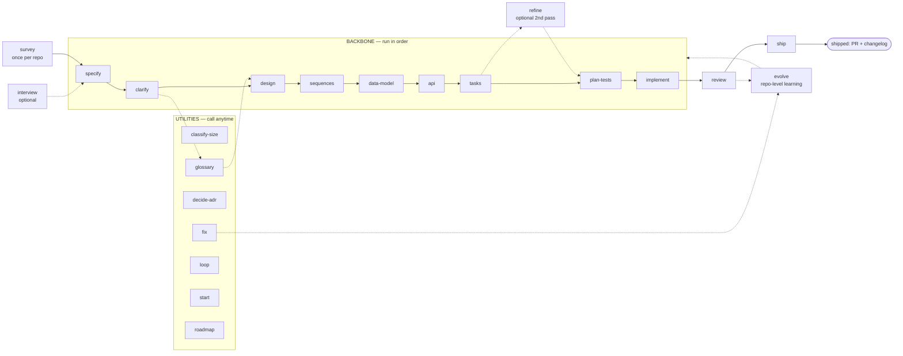

# SDD — Spec-Driven Development for Claude Code, Codex, and Cursor

A cross-tool Agent Skills package and Claude Code / Codex plugin. It takes a feature from a one-line idea to
**reviewed, verified, shipped** code. It does this through **22 atomic, stack-agnostic skills**
and a **TDD implementation engine**. A living roadmap sits above the per-feature flow. A
repo-level learning loop (`evolve`) feeds what you fixed back into the skills.

Every skill is Socratic. It walks decisions with you. It does not dump a wall of output.
Every skill is gated. A stage hard-refuses when its prerequisite artifact is missing.
Every skill is stack-agnostic. No language, tracker, or test tool is hard-coded. The skills
detect what your repo uses. The Q&A skills (`specify` / `clarify` / `design`) are also
**depth-tunable**. An easy / medium / hard dial sets how much the skill decides for you.
The dial also sets how much it interrogates you with trade-offs.

## Install

**Claude Code** — native plugin:

```text
/plugin marketplace add kanrun-digital/sdd
/plugin install sdd@sdd
```

After you update to a new release, re-run `/plugin install sdd@sdd`. Then run `/reload-plugins`.

### Codex — full install (skills + custom agents)

Use the script path when you want all 22 prefixed skills **and** the 9 named custom agents. Change
to the repository root first. By default the install is project-scoped:

- skills → `.agents/skills/sdd/`
- custom agents → `.codex/agents/sdd-*.toml`

Re-run the same command to update; the installer stages the replacement and restores the previous
complete install if the update fails. Use `--global` to install user-wide under `$HOME`; when
`CODEX_HOME` is set, global custom agents go to `$CODEX_HOME/agents/`. Python 3 is needed to
generate the custom-agent TOML files. Without it the skills still install and named-agent dispatch
falls back inline. For a reproducible/pinned install, clone or check out the desired commit and run
`./install.sh codex --src /path/to/sdd` instead of executing the moving `main` branch.

```sh
cd your-project
curl -fsSL https://raw.githubusercontent.com/kanrun-digital/sdd/main/install.sh \
  | bash -s -- codex
```

For a user-wide install, append `--global`. For an isolated test, append `--prefix DIR`. Use the
same scope flag — and the same `CODEX_HOME` value, if set — for updates and removal:

```sh
# project-scoped uninstall; add --global if that is how you installed it
curl -fsSL https://raw.githubusercontent.com/kanrun-digital/sdd/main/install.sh \
  | bash -s -- codex --uninstall
```

Start a new Codex session after installation. Run `/skills` (or type `$`) and select
`$sdd-specify`. Ask Codex to delegate to a custom agent by name, for example
“use `sdd-explorer` to map this repository.” `/agent` only inspects or switches existing agent
threads; it is not the command that starts a custom agent. Codex normally detects skill changes
automatically; restart the client if the new entries do not appear.

The visual dashboard is currently Claude Code-only: its MCP server uses Claude's live channel
protocol. Codex still discovers the `start` skill because the same skills tree is shared, but that
skill exits with a compatibility note and does not touch Claude state. The other 21 workflow skills
are unaffected.

### Codex — plugin marketplace (skills only)

This is the native distribution path on Codex builds that expose `codex plugin`. Registering a
marketplace and installing a plugin are two separate commands:

```sh
codex plugin marketplace add kanrun-digital/sdd
codex plugin add sdd@sdd
```

You can do the same through `/plugins` inside Codex. The marketplace manifest currently bundles
the skills only. Codex custom-agent TOML files are a separate local configuration surface and are
not plugin resources, and the Claude-channel dashboard is intentionally not declared as a Codex
MCP server. Therefore this path has no installed `sdd-*` custom agents or dashboard; the skills use
their documented built-in-agent/inline fallback. It also keeps the original skill names
(`$specify`), while the script path deliberately prefixes them (`$sdd-specify`) to avoid collisions
with generic names such as `review`, `design`, and `api`.

**Pick one Codex path, not both.** If both are enabled, the same workflow appears twice under
different names. The script warns when it detects `[plugins."sdd@…"]` in the active Codex config.
To remove the marketplace install, run `codex plugin remove sdd@sdd`; remove the source itself with
`codex plugin marketplace remove sdd`. To refresh a Git marketplace, run
`codex plugin marketplace upgrade sdd`, then re-run `codex plugin add sdd@sdd` when a newer version
is listed.

Codex references: [skill discovery and locations](https://developers.openai.com/codex/skills),
[custom agents and precedence](https://developers.openai.com/codex/subagents),
[plugin resources](https://developers.openai.com/plugins/build/plugins), and
[developer/slash commands](https://developers.openai.com/codex/cli/slash-commands).

> **Windows note.** The installer is a bash script. Run it from Git Bash or WSL. It writes the
> directories `.agents/`, `.codex/`, `.cursor/`. These start with a dot. Explorer hides them by
> default. Enable «Hidden items» (or run `dir /a`) to see them.

**Cursor** (2.4+) — the same script. Change to your project directory first. It installs into
`.cursor/skills/` + `.cursor/agents/` of the current directory. Use `--global` for `~`. Use
`--prefix DIR` for an arbitrary directory:

```sh
cd your-project
curl -fsSL https://raw.githubusercontent.com/kanrun-digital/sdd/main/install.sh | bash -s -- cursor
```

Then restart Cursor. Or run **Developer: Reload Window**. Invoke a stage this way: type `/` in
the chat and pick `sdd-specify`. (Cursor also reads `.agents/skills/`, so a Codex install is
already visible to Cursor.) The in-app marketplace panel works too, once the plugin is listed
on the Cursor marketplace. Installs are project- or user-scoped.

One table shows how each Claude-specific mechanism maps to Codex / Cursor. The mechanisms:
`AskUserQuestion`, subagents, `/clear`, the implement engine modes. See
[`skills/_shared/tool-adapters.md`](./skills/_shared/tool-adapters.md).

## Start here

The flow is a straight line. **Each stage writes a file the next one reads.** Run the stages
in order. The diagram + table are just below.

The pipeline examples below use Claude Code's `/sdd:<name>` spelling. With the Codex script
install, use `$sdd-<name>`; with the Codex marketplace install, use the bare `$<name>`. The installed
skill adapts the handoff to the active host.

```text
/sdd:survey                         ← once per repo: map an existing codebase, OR bootstrap an empty one
/sdd:specify checkout-discounts     ← interviews you, writes the spec (you don't bring one)
/sdd:design … → /sdd:implement … → /sdd:review … → /sdd:ship
```

Two facts come first. **`survey` runs once per repo.** On an existing codebase, it maps the
current architecture to `docs/architecture-map.md`. Every later stage reads that map. On an
empty repo, it runs a short foundation session and scaffolds the skeleton
([detail below](#where-we-study-the-codebase--hold-the-current-architecture)).
And **`specify` *creates* the spec** from a short interview. You bring the idea, not the
document.

From there you walk the backbone in order. Each stage reads the previous stage's file.
The stage refuses if the file is missing. So you cannot skip ahead by accident.

**Every stage ends with a copy-ready handoff block**
([`skills/_shared/handoff.md`](./skills/_shared/handoff.md)). It contains *What I did* +
*Review before continuing* + *Run next*. *Review before continuing* links the files the stage
wrote, so you can check them at the gate. *Run next* gives **`/clear`** and then the next
`/sdd:…` command in a fenced block. You copy it in one click.

The `/clear` matters. Each stage is gated and **re-reads its inputs from disk**. It needs no
carryover. Clearing keeps the context small. It also stops one stage's chatter from drifting
into the next. (Loop-backs are the exception. When `review` bounces back to `implement`, you
stay in context to iterate. Utilities make `/clear` optional.) It looks like this:

```md
## ✅ specify — checkout-discounts

**What I did**
- wrote docs/features/checkout-discounts/spec.md — size M (from .size); proposed commit `spec: checkout-discounts`

**Review before continuing**
- docs/features/checkout-discounts/spec.md — goals, user stories, the §5 acceptance criteria

**Run next**
1. /clear — mandatory (fresh context; the next stage re-reads its inputs from disk)
2. then run:  /sdd:clarify checkout-discounts
```

## The flow

There are three kinds of skill. Most of your time is the **backbone**. The backbone is a
straight line you walk in order. A few skills are **utilities**. You call them whenever you
need them. Two skills **close the loop** after the code is written. One skill (`evolve`)
**feeds what you learned back into the skills**.



### Step 0 — survey (once per repo, before the backbone)

| # | Skill | What it does | Reads → Produces |
|---|---|---|---|
| 0 | **survey** | Existing repo → scans once, persists the current architecture. Empty repo → level-adaptive foundation session → fixes the foundation + emits a scaffold `tasks.json` for `implement`. | the repo → `docs/architecture-map.md` (+ scaffold `tasks.json` on greenfield) |

### Backbone — the straight line (run in order)

| # | Skill | What it does | Reads → Produces |
|---|---|---|---|
| 1 | **specify** | Interviews you to capture the idea, writes the product spec + acceptance criteria (reads the architecture map for constraints) | *your idea*, `architecture-map.md` → `spec.md` |
| 2 | **clarify** | Sweeps the spec for ambiguities (a devil's-advocate pass), closes or defers each | `spec.md` → tightened `spec.md` |
| 3 | **design** | **Matches the feature to your existing architecture** (see below) + **declares the target surfaces**, writes the Arc42 SAD + C4 + ADRs | `spec.md` (+ `CONTEXT.md` if present) → `sad.md`, `adr/*` |
| 4 | **sequences** | Draws the runtime flows as Mermaid sequence diagrams | `sad.md` → `sad.md §6` |
| 5 | **data-model** | Designs the schema and writes the actual forward+rollback migrations — **staged** under the feature folder, not the live tree (`implement` promotes them) | `spec.md`, `sad.md`, sequences → `data-model.md`, staged `migrations/*.up/down.sql` |
| 6 | **api** | Derives the OpenAPI contract from the data model (or the existing schema on the fast lane) + sequences + spec | `data-model.md`, sequences, `spec.md` → `contracts/openapi.yaml` |
| 7 | **tasks** | Breaks the work into atomic ≤1-day tasks + a `tasks.json` dependency DAG | all of the above → `tasks/*`, **`tasks.json`** |
| 7b | **refine** *(optional)* | A **second pass over the written plan**. It re-reads the codebase deeper than `tasks` did. It surfaces missing tasks, vague DoD, wrong deps, duplicates, and gold-plating. It applies approved fixes to `tasks/*.md` **and** `tasks.json` atomically. Add `+check` to validate every finding through a fresh-context subagent first. The `tasks` handoff offers it as the `↳ or …` alternative. It never auto-runs. | `tasks.json` + `tasks/*` + upstream artifacts → corrected `tasks/*`, `tasks.json` |
| 8 | **plan-tests** | Maps every acceptance criterion to ≥1 test (inline in the spec for XS/S) | `spec.md`, `data-model.md` → `test-plan.md` (M+) or an inline `## Test plan` in `spec.md` (XS/S) |
| 9 | **implement** | The TDD engine: writes a failing test, makes it pass, gates, commits — per task. It **promotes** each staged migration into the live `migrations/` as it builds | `tasks.json` + all artifacts → code + tests + promoted migrations, committed |

### Close the loop (after the code is written)

| # | Skill | What it does | Reads → Produces |
|---|---|---|---|
| 10 | **review** | An **independent, clean-context** code review of the *whole* change against spec/AC + quality | the diff + `spec.md` → review record, `PASS` / `CHANGES REQUESTED` |
| 11 | **ship** | **Verifies the feature actually runs** (not just green tests), writes the changelog, opens the PR | the reviewed change → changelog + PR (never auto-merges) |

`review` can bounce back to `implement`. It does this when it finds an unmet acceptance
criterion. `ship` is the end. It gives a reviewed, verified change with a changelog and an
open PR. Merging to main stays your call.

> **"We test and review, right?"** Yes — in two places. `implement` runs a **per-task gate**
> (unit + integration + lint + vet) on every task as it goes. Each task is green before it is
> committed. Then `review` does the **independent, whole-change** code review a human reviewer
> would do on the PR. And `ship` **runs the feature for real** against its acceptance criteria.
> Tests pass continuously inside `implement`. The cross-cutting review + real-world
> verification are the explicit `review` and `ship` steps.

### Utilities — call whenever you need them (not part of the line)

- **interview** *(before specify)* — stress-tests a raw idea before you commit to a spec. It
  runs a Socratic pass. The pass surfaces hidden assumptions, names tradeoffs, and proposes
  sharper angles. It ends with the weakest spot + the next step (usually `/sdd:specify`). Any
  idea works, not just features. It is optional. Use it when the idea itself is not settled.
- **classify-size** — sizes the feature XS/S/M/L/XL and writes `.size`. Later skills read
  `.size` to decide MVP vs full depth. Run it at the start. Run it again any time scope changes.
- **glossary** — captures a domain term in `CONTEXT.md` with a definition. Run it whenever a
  new term appears. `design` and the spec read the glossary.
- **decide-adr** — writes a standalone ADR after the fact. Use it when `tasks` (or a review)
  flags a decision that needs recording but was not captured during `design`.
- **fix** — the **bugfix entry point**. It reproduces the bug. It traces the symptom to the
  spec's acceptance criteria (regression / ambiguous AC / uncovered gap). It pins the symptom
  with a failing test. It applies the minimal fix through the same gate `implement` runs. It
  then patches the spec and writes a fix record under `_fixes/`. It works on a repo with no
  specs at all. There it fixes code-first and recommends `survey`.
- **loop** — a **dedicated polish loop over one artifact** (`spec.md`, `sad.md`, `openapi.yaml`,
  `tasks.json`, any feature doc). Six phases per iteration: PLAN → PRODUCE ‖ PREPARE → EVALUATE →
  CRITIQUE → REFINE. It runs until a quality gate passes or the iteration / stagnation limit
  trips. State persists to disk, so it survives `/clear`. Every backbone skill already runs
  mini-loops (Socratic loop + critic + self-check) — reach for `loop` when those were not enough.
- **start** — opens the [visual dashboard](#the-visual-dashboard-opt-in) on Claude Code (opt-in;
  needs `dashboard_enabled: true` + Bun). On Codex/Cursor it prints the explicit compatibility
  boundary and stops.
- **roadmap** — the portfolio layer above the per-feature flow: one living `docs/roadmap.md`
  with Now / Next / Later / Shipped. Run it to capture, prioritise or re-render the board.
  `specify` and `ship` update it on their own, so it rarely needs a manual run — full detail in
  [The roadmap](#the-roadmap-the-portfolio-layer) below.

### Close the outer loop — evolve (repo-level learning)

- **evolve** — mines the pipeline's own byproducts (`_fixes/` records from `fix`, `_review/`
  records from `review`, SAD §9 Risks, Accepted ADRs) for **recurring prevention points**. It
  writes compact project-specific rules to `docs/.skill-context/sdd-<skill>/SKILL.md`. Every
  skill reads its own file at startup and treats those rules as a **project-level override** —
  on conflict the project rule wins, the same precedence a nested `CLAUDE.md` gets
  ([`skills/_shared/skill-context.md`](./skills/_shared/skill-context.md)). Processing is
  cursor-based and incremental (only evidence added since the last run, plus a tail-5 overlap
  window). It **never edits the installed skills** — a re-install would overwrite them, so all
  learning lands in the project-owned override tree. It is repo-level, like `survey` / `roadmap`:
  run it after 5–10 fixes or a review cycle. Rules are always written in **English** regardless
  of `artifact_language` — agents across sessions consume them.

## Interview depth (easy / medium / hard)

The Q&A skills open by setting a **depth dial**. The dial is one `AskUserQuestion` per run.
It sets how much the skill decides on its own. It also sets how much it interrogates you.
It changes *how many* questions you get. It never changes *what gets covered*:

- **easy** — the skill makes the reversible, low-stakes calls itself. It uses sensible
  defaults. It asks only about the irreversible / high-blast-radius calls. It **lists every
  assumption it made**, so you can veto. Analyses are minimal. Diagrams are written +
  summarized. There is no per-item question.
- **medium** (default) — the balanced Socratic walk: one question per real decision.
- **hard** — walks every decision with the trade-off in front. It runs the **full ideation
  analysis suite**: competitive research, three strategic approaches, multi-perspective
  review, devil's-advocate. It probes edge cases harder.

The default is `interview_depth` in `.claude/sdd.local.md`. Else the default is medium.
Override it per run. Or pass `--depth=easy|medium|hard`. Full semantics:
[`skills/_shared/interview-depth.md`](./skills/_shared/interview-depth.md).

Two things the dial **never** weakens. They hold at every level:

- **Readable diagrams.** `design` and `sequences` confirm each diagram **in prose**. The prose
  is a plain-language walk of the flow + branches. They write the source to the file. Obsidian
  renders it there. They **never dump raw Mermaid into the terminal** as the thing to approve.
  If `mmdc` is installed, an image is rendered too.
  ([`skills/_shared/diagram-presentation.md`](./skills/_shared/diagram-presentation.md))
- **Full use-case + acceptance-criteria coverage.** Every spec §4 user story and §5 AC is
  covered end-to-end. `specify` enforces a **use-case floor**: every user story carries ≥1 AC.
  `clarify` re-catches a story that lost its AC. `sequences` maps each user story to a flow.
  It maps each AC to a flow, a branch, or an explicit non-runtime N/A (no flow cap). `review`
  traces the whole set through spec → sequences → data-model → api → tasks → implement. It
  flags anything that dropped out. Even `easy`/XS covers every use-case + AC. It just asks
  fewer questions about *how*.

## Target surfaces (what's being built)

`design` opens §4 by declaring the feature's **target surface(s)** — *what is being built*.
The declaration is grounded in C4 container types: `backend-service`, `web-frontend`
(SSR or SPA), `mobile-app`, `desktop-app`, `cli`, `worker`, `library-sdk`. The choice comes
from the spec's "for whom". The spec stays product-level. It never names a surface. The
blast-radius gate checks the choice. A multi-surface choice usually spawns an ADR. The SAD §5
drawing shows **one C4 container per surface**. The SAD frontmatter records
`target_surfaces: [...]`. Downstream stages **read** that declaration. They gate their
output by it. They never re-derive it:

- **`api`** picks the contract form from the surface (HTTP/OpenAPI · gRPC · events · `cli.md`
  · `public-api.md`). A UI surface *consumes* the backend contract. It does not author one.
- **`sequences`** draws **UI-driven flows** (`<user>` → `<ui>` → `<service>`) for a UI surface.
- **`tasks`** adds a **`ui`** task layer for a UI surface (backend-only stays domain/infra/app/ports).
- **`plan-tests`** adds the **component / visual-regression / e2e-through-UI** tiers (the frontend
  "testing trophy") for a UI surface. `implement` detects the actual tools (Playwright / Storybook / …).
- **`review`** traces every acceptance criterion through *its* surface. A UI AC goes to a
  component / e2e-through-UI test, not only a backend one.
- **Reuse, don't reinvent.** `survey` inventories the existing **design system / components /
  tokens / styling** into `architecture-map.md` §Frontend. `design` / `tasks` / `implement`
  **compose and extend** it. They model new UI on the closest existing screen. They do not
  hand-roll new UI. This is the frontend echo of the backend's match-the-repo +
  copy-the-closest-precedent.

It is **Option B**. Frontend awareness is threaded through the existing stages: a `ui` layer,
UI-architecture ADRs, UI flows, frontend test tiers. There is deliberately **no** separate
component-tree / design-token / screen artifact. Full semantics:
[`skills/_shared/surfaces.md`](./skills/_shared/surfaces.md).

## Where the spec comes from

You do not write the spec as an input. **`specify` produces it.** Its interview front asks
3–5 questions. The questions cover the problem, the users, and what success looks like. It
then drafts the spec. It validates each acceptance criterion with you. It runs a
clean-context critic before it writes `spec.md`. The idea is the input. The spec is the
output.

## Where we study the codebase / hold the current architecture

The existing system is studied **once, in `survey`** (Step 0). `survey` persists
`docs/architecture-map.md`. The map holds the current architecture: module layout, layering,
datastores, conventions, and a C4 of what exists. That map is the single source of "what's
already here":

- **`specify`** reads it. The spec's constraints / non-goals then reflect the real system.
  No tech leaks into the acceptance criteria.
- **`design`** reads it and **matches** the feature to that reality. The SAD describes *your*
  system extended. It is not a greenfield design in a vacuum. `design` re-scans (via
  `explorer`) only if the map is missing or stale.
- **`data-model`** and **`implement`** read it for the persistence + wiring conventions.
  The new code must follow them. The stages do not re-discover them each time.

So you do not re-open "what's the current architecture?" at every stage. `survey` answers it
once. The map carries it. Refresh the map (run `survey` again) when the repo has drifted
past the `reflects_commit` it records. In `design`, decisions expensive to reverse cross a
blast-radius gate. They become ADRs.

**On an empty project there's no current architecture to study. So `survey` establishes
one.** Its greenfield mode gauges how you want to engage. It then picks the stack /
structure / data approach / conventions with you (defaults-heavy). It fixes them as the
foundation. The foundation is the same map, marked `mode: greenfield-bootstrap`, plus
foundational ADRs for the irreversible choices. It also emits a scaffold `tasks.json`.
`implement` then materializes the skeleton. The skeleton is anchored on a smoke test
(«builds + boots + the test and migration tooling run»), not on per-folder TDD. After that
the repo is real. The per-feature flow builds into it normally.

## The roadmap (the portfolio layer)

The backbone builds **one feature at a time**. `roadmap` is the layer **above** it. It is
one living `docs/roadmap.md`. It shows the work *across* features. It stays at **outcome
altitude**: the "why", not a feature-and-date list. A feature-and-date list is the biggest
source of planning waste:

- **Now** — committed, spec'd, in progress. Each item links to its `docs/features/<slug>/`
  + a status. It doesn't restate the spec.
- **Next** — problems/opportunities, deliberately *not* yet spec'd, ordered by a light **RICE**
  score (Reach × Impact × Confidence ÷ Effort). This is the candidate pool.
- **Later** — directional outcomes/themes, no detail.
- **Shipped** — what landed, with a link.

It stays current because the pipeline updates it. **`specify` promotes a feature to Now.**
**`ship` moves it to Shipped.** Delivery itself keeps the roadmap in sync, so it doesn't rot.
It carries a one-line "direction, not a promise" disclaimer. It never carries dates.

## The implementation engine

`implement` reads `tasks.json` and builds a dependency DAG. It runs a **TDD cycle per
task** — `SELECT → RED → GREEN → REFACTOR → GATE → COMMIT`. It writes a failing test first.
It proves the failure is for the right reason. It writes the minimal code to pass. It keeps
refactors green. It runs the gate. It commits with `SDD-Task` / `SDD-AC` trailers.

There are three execution modes. They are chosen automatically from settings + DAG shape.
Fallback is graceful:

- **Sequential single-agent TDD** — the default and the floor everything degrades to.
- **Agent team** (`team_mode: true`) — `test-author` → `implementer` → `reviewer`
  over the DAG, coordinated through a shared task list, one git worktree per agent.
- **Dynamic workflow** (`workflow_mode: auto`) — a generated `Workflow` pipeline on Claude Code,
  or a parent-orchestrated native subagent DAG on Codex. Independent tasks run in parallel up to
  the same cap.

## Models, effort & agents

Every skill and every agent declares an **execution profile** in its frontmatter. The
profile states which model, how much reasoning effort, and which agents it spawns:

```yaml
# a skill's frontmatter
model: inherit     # every shipped skill and agent is `inherit` — it runs on the session model
effort: high       # low | medium | high | xhigh | max
agents: [critic]   # the agents this skill spawns
```

**Every shipped skill and agent declares `model: inherit`.** That is deliberate, and it is what
makes SDD host-portable: the skill runs on whatever model your session already uses. The policy
below is expressed in **portable tier-labels** (`cheap` / `balanced` / `judgment`) rather than
hard-coded model names. On Anthropic hosts the tiers map to `haiku` / `sonnet` / `opus` (or
`fable` for the Mythos tier). On non-Anthropic backends — including Codex — the host's own model
settings resolve each tier. You pick the tier with `judgment_model` / `model_<role>` in
`.claude/sdd.local.md`, or with the host's config; you never edit a skill's frontmatter. Under
Codex, Anthropic aliases in that historical settings file are tier labels and are not passed as
invalid Codex model IDs; set a supported full model ID only when you want to pin one.

The **kind of work** sets the tier, not taste:

| Kind of work | Tier | Effort | Who |
|---|---|---|---|
| Judgment (spec, design, review, critique, ambiguity, strategy) | `judgment` | `high` | specify, clarify, design, review · `reviewer` / `critic` / `devils-advocate` / `strategist` / `analyst` |
| Execution (write tests, write code) | `balanced` | `medium` → `high` on escalation | `test-author`, `implementer` |
| Research / gathering (+ web) | `balanced` | `medium` | `researcher` (competitive / adjacent-solution research) |
| Search / scan / derivation | `cheap` | `low` / `medium` | `explorer`, data-model, api, sequences, tasks |

The nine agents live in `agents/`: **explorer** (brownfield scan), **test-author** (failing
tests), **implementer** (makes them pass), **reviewer** (independent review), **critic**
(coherence critique), **devils-advocate** (ambiguity + failure-mode hunt), **researcher**
(competitive / web research), **strategist** (three strategic approaches), **analyst**
(multi-perspective review). The read-only judgment agents are explicitly dispatched with
**clean isolated context** (fresh eyes); this is policy, not an assumption about every host.
They emit only cited findings. The last three are the **ideation analyses**. `specify`
dispatches them. The depth dial gates them. Easy skips them. Hard runs the full suite.

Two policy levers sit on top of the table. **`judgment_model`** (`.claude/sdd.local.md`, values
`opus | fable | <full-model-id>`) selects all judgment agents (`reviewer` / `critic` /
`devils-advocate` / `strategist` / `analyst`) in one switch. A per-role `model_<role>` key still
wins. On Claude, **L/XL** critical verifications run at `effort: xhigh` through
`CLAUDE_CODE_EFFORT_LEVEL`. The Codex installer instead pins each custom agent's source effort in
`model_reasoning_effort`; Codex gives that file value highest precedence. If an SDD run needs a
different one-off effort (for example `xhigh`), it must use a built-in agent with the same role
prompt and an explicit effort, or a separately configured custom-agent variant. It must not claim
that a pinned `sdd-*` agent was overridden.

The full host-specific policy lives in one place:
[`skills/_shared/agent-roster.md`](./skills/_shared/agent-roster.md). It covers Claude and Codex
precedence separately, `.size` scaling, custom-agent sandbox limits, and the Claude env-var
fallback. `CLAUDE_CODE_*` variables are never presented as Codex controls.

### Configuration — `.claude/sdd.local.md`

The pipeline **auto-creates** this per-project settings file (YAML frontmatter). It writes
**documented defaults** the first time a skill needs it. That is normally `specify` at the
start. It also adds the file to `.gitignore`. The file is per-developer. The file is
**self-documenting**: every key carries its default, its allowed values, and a one-line
explanation inline. Edit it to change behaviour. Three keys are **plugin-wide**.
The `.claude/` name is retained for backward compatibility; under Codex this is ordinary
repo-relative SDD data, not native Codex configuration.
`interview_depth` is read by the Q&A skills (`specify` / `clarify` / `design`) to
pre-select the depth dial. `artifact_language` is read by every artifact-writing skill.
It sets the language pipeline documents are written in. It changes prose only. Section
headings, frontmatter and machine tokens stay English (full rule →
[`skills/_shared/artifact-language.md`](./skills/_shared/artifact-language.md)).
`conversation_language` is read by every skill that asks a question. It sets the language
those questions are asked in. The rest of the keys configure the `implement` engine:

> **Two language switches, deliberately independent.** `conversation_language` is what the
> pipeline **talks to you in** (every `AskUserQuestion` — its question text and option
> labels/descriptions). `artifact_language` is what it **writes into documents**. An interview
> in Ukrainian with the spec written in English is a supported combination, and so is the
> reverse. Neither switch touches code, tests, commit messages, branch names, section headings,
> frontmatter, or any machine token — those are always English. Phrasing contract →
> [`skills/_shared/ask-style.md`](./skills/_shared/ask-style.md).

> **`executor_tier` — the one dial about the *executor*, not the work.** The others describe the
> job: `.size` how big the feature is, `.route` which stages run, `interview_depth` how much you
> are asked. This one describes **who will write the code from the plan**. On `cheap` (a small
> model, or a contributor with no context) `tasks` and `refine` make the plan finer and more
> literal — half-day tasks, `files_hint` naming files rather than directories, a named precedent
> file to model on, numbered steps, no open choice left to the executor, and a DoD that names the
> verification command. It never copies upstream prose into a task: precision, not duplication —
> a copy drifts, a link does not. AC coverage and the dependency graph are identical at every
> tier. Default `balanced` = today's behaviour. Full semantics →
> [`skills/_shared/executor-tier.md`](./skills/_shared/executor-tier.md).

```yaml
interview_depth: medium    # easy | medium | hard — default depth for specify/clarify/design
artifact_language: en      # en | uk — the language pipeline documents are written in (headings + machine tokens stay English)
conversation_language: uk  # uk | en — the language the skills ASK you questions in (independent of artifact_language)
executor_tier: balanced    # cheap | balanced | judgment — how capable the plan's executor is; tasks/refine calibrate granularity to it
tdd: true                  # enforce red→green→refactor
team_mode: false           # true → TeamCreate on Claude; native custom subagents on Codex
workflow_mode: auto        # auto → Workflow or host subagent-DAG equivalent; off → never
max_parallel_agents: 3
isolation: worktree        # worktree | inplace (parallel>1 ⇒ forces worktree)
stop_on_red: true
max_red_retries: 3
gate_lint: true
gate_vet: true
require_integration: auto  # auto | always | never (Docker-probed)
auto_commit: per_task      # per_task | per_phase | off
branch_strategy: feature   # feature | current
cmd_test_unit: ""          # empty = autodetect (escape hatch)
cmd_test_integration: ""
cmd_lint: ""
cmd_vet: ""
model_test_author: sonnet  # Claude alias; Codex inherits unless this is a supported full model ID
model_implementer: sonnet
model_reviewer: opus
judgment_model: opus       # Claude alias or full host model ID; one switch for all judgment agents
effort_test_author: medium # raised to high on escalation / for L-XL features
effort_implementer: medium
effort_reviewer: high
dashboard_enabled: false   # Claude Code only: true → opt into the visual dashboard (needs Bun)
dashboard_port: 4178       # integer — loopback port the dashboard binds (scans upward if busy)
```

Command detection is a stack-agnostic cascade: settings override → Makefile targets →
`package.json` scripts → language manifests (`go.mod`, `Cargo.toml`, `pyproject.toml`, …) →
Docker probe for the integration tier.

## Quick start (idea → shipped)

Every stage takes one argument: the **feature slug**. The slug is a kebab-case name you make
up once at the start (here `checkout-discounts`). It becomes the folder every artifact lands
in — `docs/features/checkout-discounts/`. It is how each stage finds the previous stage's
files. So use the **same slug at every stage**.

```text
/sdd:survey                             # once per repo: map the current architecture
/sdd:specify       checkout-discounts   # interview → spec (reads the architecture map)
/sdd:clarify       checkout-discounts
/sdd:design        checkout-discounts
/sdd:sequences     checkout-discounts
/sdd:data-model    checkout-discounts
/sdd:api           checkout-discounts
/sdd:tasks         checkout-discounts
/sdd:plan-tests    checkout-discounts
/sdd:implement     checkout-discounts
/sdd:review        checkout-discounts   # independent review of the whole change
/sdd:ship          checkout-discounts   # verify it runs, changelog, PR
```

Three more you call by hand when you want them — none is part of the line:

```text
/sdd:refine        checkout-discounts   # optional 2nd pass over the plan, after /sdd:tasks
/sdd:loop          checkout-discounts   # polish one artifact until its quality gate passes
/sdd:evolve                             # repo-level: turn _fixes/ + _review/ into skill rules
```

> **`/clear` between stages** — each stage is gated. It re-reads its inputs from disk. It
> ends by printing the next `/sdd:…` command to copy (the handoff block). Loop-backs
> (`review` → `implement`) stay in context. Utilities make `/clear` optional.

Three notes on the first run:

- **You don't need `classify-size` to start**. `specify` classifies the feature and writes
  `.size` itself when it's absent. Run `/sdd:classify-size <slug>` only to size it *before*
  specifying. Or run it to re-classify when scope changes.
- **Skip the depth question** by passing the dial inline: `/sdd:specify checkout-discounts
  --depth=easy`. It also works on `clarify` / `design`. Values: `easy|medium|hard` — see
  [Interview depth](#interview-depth-easy--medium--hard).
- Artifacts land in `docs/features/<slug>/`.

### Routes — quick / standard / full

A small feature doesn't need the full backbone. It also shouldn't need a confirmation at
every stage. Alongside `.size`, classification writes a **route** to
`docs/features/<slug>/.route` (one word: `quick` / `standard` / `full`). Defaults:
**XS/S → quick, M → standard, L/XL → full**. The size and route are confirmed together in
the **same single question**. You can always pick a different route. The route decides how
each handoff treats the optional stages (`clarify`, `sequences`, `data-model`, `api`,
`plan-tests`):

- **`quick`** — the stage checks the skip condition **itself**. If the stage's work doesn't
  exist, it's **auto-skipped with the reason stated** («auto-skipped clarify: zero open
  questions»). The `↳ or …` line inverts to offer the full path instead. If the work *does*
  exist, the stage runs.
- **`standard`** — today's behaviour: the handoff **offers** the skip as `↳ or …` and you pick.
- **`full`** — every optional stage runs. No skip alternatives are printed.

Example — a config-toggle-sized feature (`quick` route) in one session:

```text
/sdd:specify  rate-limit-bump --depth=easy   # size XS + route quick confirmed in one question →
                                             #   zero open questions → auto-skips clarify (says why)
/sdd:design   rate-limit-bump                # one actor, no multi-step flow, no schema change →
                                             #   auto-skips sequences + data-model → next: api or tasks
/sdd:tasks    rate-limit-bump                # never skipped: implement consumes tasks.json
/sdd:implement rate-limit-bump               # test plan lives inline in spec.md on quick
/sdd:review   rate-limit-bump
/sdd:ship     rate-limit-bump
```

The skip conditions (`clarify` — zero open questions, `sequences` — no multi-step flow,
`data-model` — no schema change, `api` — no contract change, `plan-tests` — inline in the
spec) are canonical in [`skills/_shared/size-matrix.md`](./skills/_shared/size-matrix.md).
They're **N/A conditions, not size defaults**. An XS feature *with* a migration still runs
`data-model`, on every route. The route steers handoffs only. It never locks a door.
Re-run `/sdd:classify-size <slug>` to switch routes mid-flight. Or just invoke a skipped
stage directly — it always runs.

### When a stage refuses

Stages are gated. Each one **hard-refuses when the artifact it consumes is missing**. It
names the stage to run first. A refusal is not an error. The pipeline tells you which step
was skipped. The ones you're most likely to meet:

| Refusal | What it means | What to do |
|---|---|---|
| `design`: «run `specify` first» | there's no `spec.md` for this slug yet (or the slug is spelled differently) | run `/sdd:specify <slug>`. Check the slug matches the folder under `docs/features/` |
| `api`: «run `data-model` first» | the feature **changes the schema** but has no `data-model.md` — the contract can't be invented field-by-field. (No schema change → `api` doesn't refuse: it derives from the existing schema — the legal fast-lane skip) | run `/sdd:data-model <slug>` |
| `tasks`: «no Accepted ADR» | `design` spawned no ADR (rare — usually a sign the SAD walk was cut short) | run `/sdd:decide-adr <slug>` for the key decision, or re-run `/sdd:design <slug>` |

## Repository layout

```
.claude-plugin/   plugin.json + marketplace.json (self-marketplace)
.codex-plugin/    Codex CLI plugin manifest (+ .agents/plugins/marketplace.json — its self-marketplace)
.cursor-plugin/   Cursor plugin manifest (skills/ + agents/ auto-discovered from the root)
install.sh        Codex CLI / Cursor installer — copies the subtree, prefixes skill names, generates functional agents
agents/           explorer, test-author, implementer, reviewer, critic, devils-advocate, researcher, strategist, analyst
scripts/          validate_plugin.py (CI gate: manifests + skill/agent frontmatter + the consistency invariants — links resolve, /sdd: form, handoff block, single-source taxonomy, no _shared orphans)
skills/_shared/   canonical socratic-loop / critic / size-matrix / ask-style / interview-depth / diagram-presentation / surfaces / handoff / self-check / agent-roster / mermaid-check / artifact-language / skill-context / tool-adapters (referenced, not duplicated)
skills/<name>/    SKILL.md spine + references/ (heavy detail) + templates/ (output scaffolds)
.mcp.json         declares the sdd-dashboard MCP server (auto-starts at session open; opt-in via dashboard_enabled)
server/           the dashboard MCP server (Bun + TypeScript): server.ts (MCP stdio + Bun.serve HTTP/WS), http.ts (routing + gating, testable), state.ts (disk→pipeline derivation), channel.ts (dashboard_* tools + command allowlist), paths.ts (docs/ scoping), frontmatter.ts (shared parser) + tests/ (bun test)
dashboard/        the browser UI (vanilla JS, terminal-green, read-only): index.html + app.js + style.css + vendor/ (marked, mermaid — vendored, offline; mermaid lazy-loads)
evals/            end-to-end skill scenarios (prompt + fixture + rubric) scored by an LLM judge — run.sh, judge-prompt.md
.github/          workflows/validate.yml — runs validate_plugin.py + the installer smoke test on Linux and macOS
assets/           logo (svg + png)
CONTRIBUTING.md   the per-change checklist (links resolve, invocation form, handoff block, single-source taxonomy)
```

## Roadmap

Directions under consideration — not promises, no dates:

- **`sync`** — spec↔code drift detection. It re-derives what the code actually does. It
  diffs that against the spec/SAD. Long-lived features then don't quietly outgrow their
  documents.
- **Traceability matrix + adherence score** — `review`/`ship` emit a single AC × (flow /
  contract / task / test / commit) matrix with a coverage score. This replaces prose-only
  tracing.
- **Tracker integration** — `tasks.json` ⇄ Jira / Linear / GitHub Issues two-way sync.
  Today the export is one-shot and copy-paste.
- **Constitution file** — a repo-level set of inviolable rules (security, compliance,
  style). Every stage reads them. The validator enforces them. They complement the
  per-feature artifacts.

**Shipped:** ~~MCP exposure~~ → see **[The visual dashboard](#the-visual-dashboard-opt-in)** below.

## The visual dashboard (opt-in)

> **Claude Code-only today.** The dashboard's inbound session channel is Claude-specific. Codex
> and Cursor install the shared `start` skill, but it stops with a compatibility note and never
> starts or fabricates this MCP integration.

The roadmap's *"MCP exposure — pipeline state served over MCP so external tools and dashboards can
read where every feature stands"* has shipped. It also gained a control surface. The plugin
carries an **`sdd-dashboard` MCP server** (`server/`, Bun + TypeScript). It auto-starts with
every Claude Code session (declared in `.mcp.json`). When enabled, it serves a **local
browser dashboard** (`dashboard/`) on `127.0.0.1`. It reads every feature off disk
(`docs/features/<slug>/`). It shows its pipeline as a per-step checklist — `done` / `skipped`
/ `pending` / `blocked`. It renders each artifact (markdown + **mermaid** diagrams from vendored libs, fully
offline — OpenAPI renders as plain YAML). Artifacts render in whatever
language they're written. The state derivation reads only the English structural tokens.
Those tokens never translate (see `artifact_language` above). Pure-markdown users who never
opt in are unaffected. Nothing binds. Nothing opens.

### Launch it — three steps

1. Install **[Bun](https://bun.sh)**, the server runtime. The official Telegram plugin
   uses the same dependency: `curl -fsSL https://bun.sh/install | bash` or `brew install bun`.
2. Set `dashboard_enabled: true` in your project's `.claude/sdd.local.md`
   (see [Configuration](#configuration--claudesddlocalmd)).
3. Run **`/sdd:start`** in your Claude Code session. The server is already running. It
   auto-started with the session. This step just hands it your project directory. It binds
   the port if needed. It prints the URL:
   `http://127.0.0.1:<port>/?session=<id>&token=<capability-token>`. Open that exact URL
   in a browser. The token in it authorises the session.

A new session mints a new token. A server restart does too. So an old tab goes stale.
Re-run `/sdd:start` and open the fresh URL.

### How the panel updates

Three mechanisms, layered:

1. **Live, from disk.** The server watches `docs/` (`fs.watch`). It pushes a refresh over
   the WebSocket whenever an artifact changes. It does not matter who changed it: a
   dashboard-driven run, a skill you ran in the terminal, or you editing `spec.md` in vim.
   Changes appear within ~1 second.
2. **Enriched, from Claude.** When Claude runs a stage it also calls `dashboard_update` /
   `dashboard_log` / `dashboard_done`. These calls feed the live activity feed, stage
   transitions, review verdicts and the final handoff. A terminal-only run still refreshes
   the artifacts (mechanism 1). It just doesn't narrate.
3. **Self-healing connection.** The server pings the WebSocket to keep it alive. If it
   drops anyway, the browser reconnects with backoff. It re-syncs everything from disk.
   Nothing stays stale.

### How you control it

Four buttons drive your live session: **▶ Run next stage**, per-stage **run**, **⚒ Fix**
(appears on a CHANGES REQUESTED review), **+ new**. The semantics are honestly
**asynchronous**:

- A click sends the request to the server. The server builds a validated `/sdd:<skill> <slug>`
  command from a strict server-side allowlist. It **queues** the command into your Claude
  session. It uses the same channel mechanism the official Telegram plugin uses
  (`notifications/claude/channel`).
- The session consumes a queued command **only while idle at the prompt**. If Claude is
  mid-task, the command waits. Every queued command gets its own `queued → running → done`
  status line. The UI never fakes synchronous execution.
- The **depth selector** (topbar) sets `--depth` for dashboard-driven runs. Values: `easy`,
  `medium`, or `hard`. `easy` is the default. Skills self-decide reversible calls and
  rarely block on questions.
- A dashboard-driven run can genuinely need a human decision. Then Claude posts the
  question **into the panel** (`dashboard_ask`). A card with 2–4 option buttons appears in
  the activity pane. The run pauses. Your click sends the answer back through the same
  queue. The run resumes. The browser only ever sends an option *index*. The option text
  was authored by Claude itself. You can always answer in the terminal instead.
- Free browser text can never become a command. Only the validated skill name + slug +
  depth pass the allowlist.

### What the panel does NOT do

- It never writes to disk. Only the pipeline in your terminal edits artifacts.
- It has no chat input. A blocking `AskUserQuestion` in the **terminal** stays
  terminal-only. The panel's option cards exist precisely so dashboard-driven runs don't
  block there. But free text never travels from the browser into the session.
- It doesn't survive a server restart. Re-run `/sdd:start` for a fresh URL/token.

**Setup, config & troubleshooting:** [`server/README.md`](./server/README.md).

**Security:** the server binds loopback only. The API is read-only. Every read is
realpath-contained to `docs/` with an extension allowlist. All routes require a
per-session capability token. Inbound commands are built **only** from a server-side
skill + slug allowlist. Browser text never becomes an arbitrary `/sdd:` command.

## License

MIT © Kyrylo Genkov. See [LICENSE](./LICENSE).
