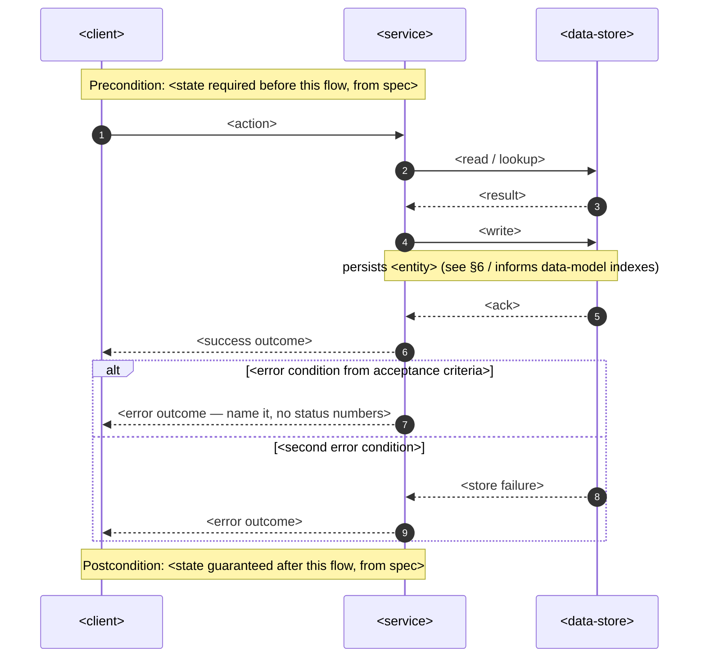
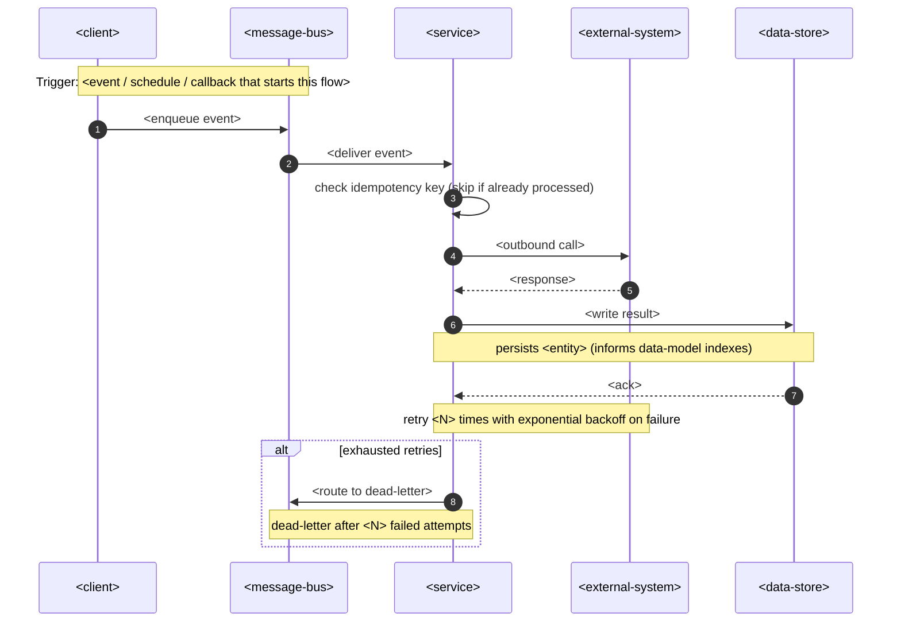
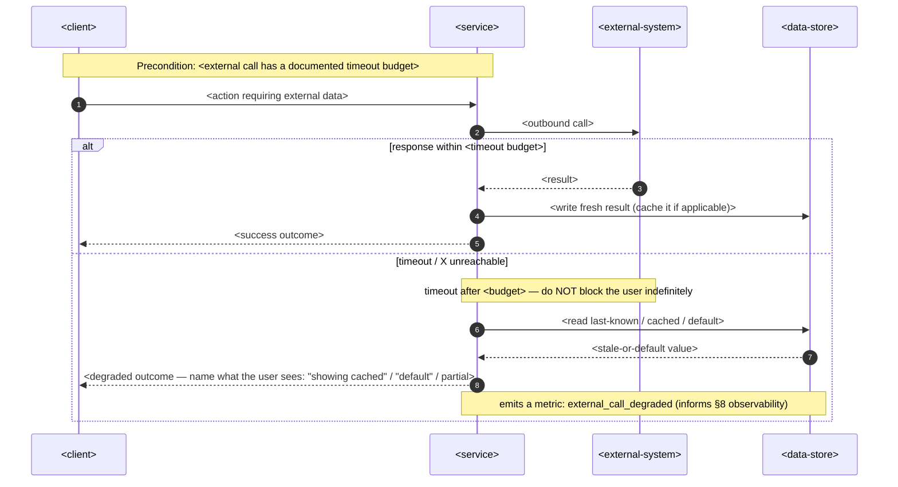
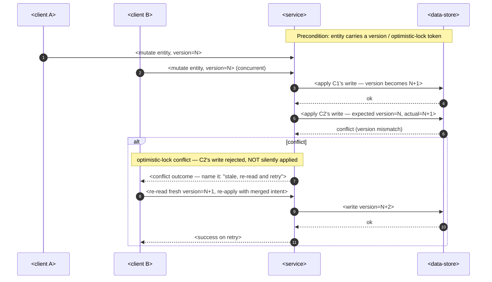

<!-- Template for `sequences` — embedded INLINE in docs/features/<slug>/sad.md §6 (Runtime view). -->
<!-- One `### <flow name>` block per critical flow. Participants are GENERIC placeholders — -->
<!-- replace the <…> message/note text with this flow's specifics, NOT the participant names. -->
<!-- Generic vocabulary (the only allowed participants): -->
<!--   <client>          — whatever initiates the flow (UI, CLI, another service, a scheduler) -->
<!--   <service>         — the building block that owns this flow (from §5) -->
<!--   <data-store>      — the persistent store the service reads/writes -->
<!--   <external-system> — a third party the service calls -->
<!--   <message-bus>     — async transport (queue / event stream) for non-sync flows -->
<!-- Naming the concrete technology is `design`/`data-model`'s job, not the runtime view's. -->

### <flow name>

<!-- SYNC flow: request → response, with the error branches the spec's acceptance criteria demand. -->
<!-- Every write becomes a persist note so `data-model` knows what to index downstream. -->



### <async flow name>

<!-- ASYNC flow (webhook in / scheduled job / queued or event-driven step / third-party callback). -->
<!-- MUST include: idempotency-key check as the first handler step, a retry note, a dead-letter branch. -->



### <compensation flow name> (saga rollback — draw when ≥2 async actors chain)

<!-- COMPENSATION flow (W5). Draw when a flow chains ≥2 async actors into a multi-step saga and a -->
<!-- later step can fail after an earlier step already committed side-effects. The dead-letter -->
<!-- branch above only quarantines the failing step. It does NOT undo the steps that succeeded. -->
<!-- Gate: if you draw a multi-step async flow, draw this OR mark an explicit N/A with a reason -->
<!-- ("each step is independently idempotent + DLQ-only is an accepted policy — ADR-NNNN"). -->

```mermaid
sequenceDiagram
    autonumber
    participant C as <client>
    participant S as <service>
    participant D as <data-store>
    participant X as <external-system>

    Note over C,S: Saga: steps 1..N each commit a side-effect; step K failed
    Note over S,D: Step 1..K-1 already committed (not rolled back by the dead-letter)
    S->>S: step K failed — initiate compensation
    loop undo steps K-1 down to 1
        S->>D: <compensating write — reverse of step i's effect>
        Note over S,D: e.g. release reserved stock / refund charge / mark record void
        S->>X: <compensating outbound call if step i called out>
    end
    S->>D: <mark saga as compensated-failed>
    Note over C,S: Postcondition: no partial success leaked — the saga is all-or-nothing OR the
    Note over C,S: compensations are documented + the final state is consistent
```

### <timeout / degrade flow name> (fallback when an external-system call times out)

<!-- TIMEOUT / DEGRADE flow (W5). Draw when a flow includes an <external-system> participant and -->
<!-- the spec's success criteria cannot tolerate indefinite blocking. Gate: if you draw a flow -->
<!-- with <external-system>, draw a timeout branch OR mark N/A with a reason -->
<!-- ("the call is fire-and-forget / has its own async retry — no sync degradation needed"). -->



### <concurrency / conflict flow name> (optimistic-lock conflict)

<!-- CONCURRENCY flow (W5). Draw when ≥2 writers can race on the same entity (two requests mutating -->
<!-- the same record, two jobs claiming the same work item). Gate: if the spec's domain-invariant -->
<!-- ACs imply concurrent writes to one entity, draw this OR mark N/A ("single-writer guarantee -->
<!-- elsewhere — e.g. a queue serializes writes to this entity"). -->


